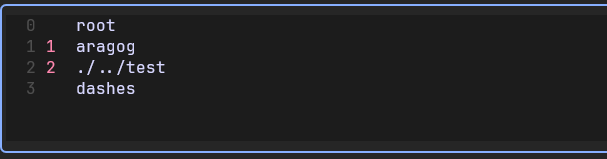
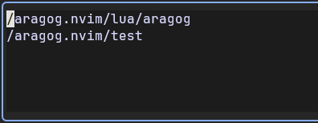
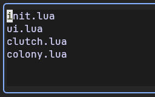
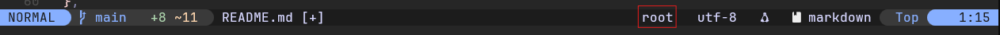
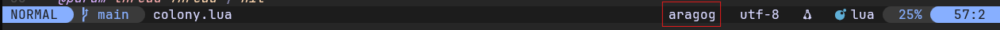
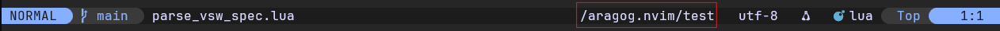

# 🕸️ Aragog.nvim

**Aragog** is your faithful eight-legged assistant — a Neovim plugin for fast, intuitive navigation between files, workspaces, and projects.
Inspired by the vast, intelligent web of Aragog and his kin, this plugin lets you spin your own dev ecosystem, jumping from **Thread** to **Thread** one **Burrow** to another inside your sprawling **Colony**.

> "The spiders fled before me. But Aragog remained."  
> — _Rubeus Hagrid (probably talking about your workflow)_

## TL;DR

- Organize related workspaces into a **Colony**
- Each Colony is made up of individual **Burrows** (workspaces)
- Track and jump to pinned **Threads** (files/buffers) within a Burrow

## Why Aragog?

Most project/file nav plugins are like little garden spiders.  
**Aragog** is the king of the Forbidden Forest.

- **Blazingly fast** file jumps within and across projects
- **Workspace-level awareness** — not just open files
- **Persistent layouts** you can re-enter like you never left
- Built on a web of smart, flexible metaphors

> — _Freebie Gpt_

## Key Concepts

| Concept | Description                                   |
| :-----: | --------------------------------------------- |
| Colony  | A collection of related workspaces (projects) |
| Burrow  | A single workspace within a Colony            |
| Thread  | A target file or destination within a Burrow  |

## Usage

Display vs workspaces, add to burrows with `a`, remove with `x` or set to index with `1`, `2`, `3`, `4`



Display burrows (the list can be edited)



Display threads of current burrow (the list can be edited)



## Installation

- install using lazy.nvim

```lua
{
  {
    "bipedal-eel/aragog.nvim",
    config = function()
      local aragog = require "aragog"
      aragog.setup()
    end,
    keys = {
      { "<leader>a", function() require("aragog").add_file() end,                      desc = "Add file to current thread" },
      { "<leader>0", function() require("aragog").toggle_current_threads_window() end, desc = "Toggle current thread window" },
      { "<leader>1", function() require("aragog").goto_thread_destination(1) end,      desc = "Navigate to file 1" },
      { "<leader>2", function() require("aragog").goto_thread_destination(2) end,      desc = "Navigate to file 2" },
      { "<leader>3", function() require("aragog").goto_thread_destination(3) end,      desc = "Navigate to file 3" },
      { "<leader>4", function() require("aragog").goto_thread_destination(4) end,      desc = "Navigate to file 4" },
      { "<M-w>",     function() require "aragog".toggle_burrows_window() end,          desc = "Toggle burrows window" },
      { "<M-W>",     function() require "aragog".toggle_workspace_window() end,        desc = "Toggle workspace window" },
      { "<M-0>",     function() require "aragog".root_burrow() end,                    desc = "Swich to root burrow" },
      { "<M-1>",     function() require "aragog".switch_burrow(1) end,                 desc = "Switch to burrow 1" },
      { "<M-2>",     function() require "aragog".switch_burrow(2) end,                 desc = "Switch to burrow 2" },
      { "<M-3>",     function() require "aragog".switch_burrow(3) end,                 desc = "Switch to burrow 3" },
      { "<M-4>",     function() require "aragog".switch_burrow(4) end,                 desc = "Switch to burrow 4" },
    }
  },
}
```

## lualine

The current burrow is set as a global variable `aragog_current_burrow` and can thus be displayed in your lualine.

```lua
lualine_x = { "g:aragog_current_burrow", "encoding", "fileformat", "filetype" },
```

If there is a .vscode/\*-code.workspaces file, argog_current_burrow is set to the name of the workspace.





The relative path is shown as fallback


